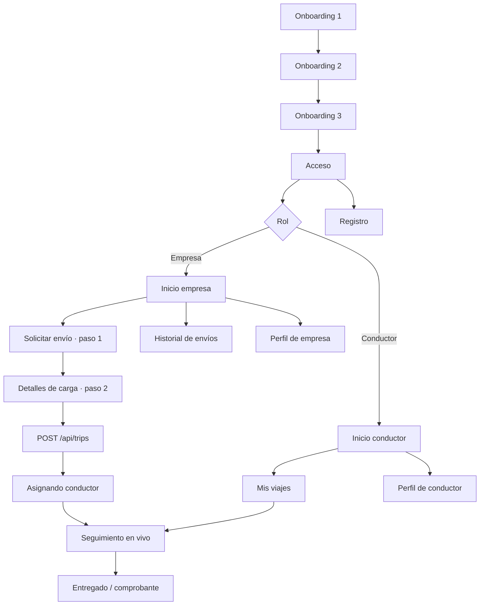

# INCOEX Apps · flujo de navegación y contrato de datos

La app Flutter contiene dos experiencias: empresa y conductor. La misma capa `apps/lib/core/api_client.dart` concentra el acceso a NestJS y las pantallas consumen modelos tipados en `apps/lib/models/api_models.dart`.

## Flujo general

## Pantallas y responsabilidades

| Flujo | Pantallas | Fuente de datos |
|---|---|---|
| Primera apertura | Onboarding 1, 2 y 3 | Configuración local de presentación |
| Identidad | Acceso y Registro | `POST /api/auth/login` y `POST /api/auth/register` |
| Empresa | Inicio, solicitud paso 1, detalles paso 2 | `GET /api/trips`, `POST /api/trips` |
| Asignación | Asignando conductor | Viaje creado por la API; asignación automática real pendiente |
| Seguimiento | Mapa visual, estado, conductor y ruta | `GET /api/trips/:id/tracking` |
| Cierre | Entregado / comprobante | Estado del viaje y tracking de la API |
| Empresa secundaria | Historial y Perfil | `GET /api/trips` y sesión activa |
| Conductor | Inicio, Mis viajes y Perfil | `GET /api/trips` y sesión activa |

## Contrato móvil actual

| Acción | Endpoint | Comportamiento |
|---|---|---|
| Iniciar sesión | `POST /api/auth/login` | Guarda sesión de prototipo en memoria de la app |
| Crear cuenta | `POST /api/auth/register` | Crea respuesta de prototipo; persistencia real pendiente |
| Consultar envíos | `GET /api/trips` | Alimenta inicio, historial y viajes del conductor |
| Crear solicitud | `POST /api/trips` | Envía cliente, origen, destino, paquetes, descripción, destinatario y fragilidad |
| Consultar tracking | `GET /api/trips/:id/tracking` | Alimenta estado, ruta, conductor y comprobante |

## Reglas de navegación

- El usuario solo entra a Inicio después de que la API responda correctamente al login o registro.
- Una solicitud válida necesita origen, destino y al menos un paquete.
- La pantalla de asignación conserva el identificador real devuelto por NestJS.
- Historial y tracking muestran error y opción de reintento si el backend no responde; no sustituyen datos por fixtures locales.

## Estado de implementación

El cliente HTTP, login, registro, creación de viaje, historial, tracking y comprobante ya están cableados al contrato inicial de NestJS. La API todavía usa un `OperationsStore` en memoria para esta fase de presentación. Para producción faltan JWT y refresh tokens reales, PostgreSQL, filtros por usuario, actualizaciones de estado del conductor, GPS del dispositivo, WebSockets, evidencias en almacenamiento, notificaciones y pruebas sobre dispositivos físicos.
